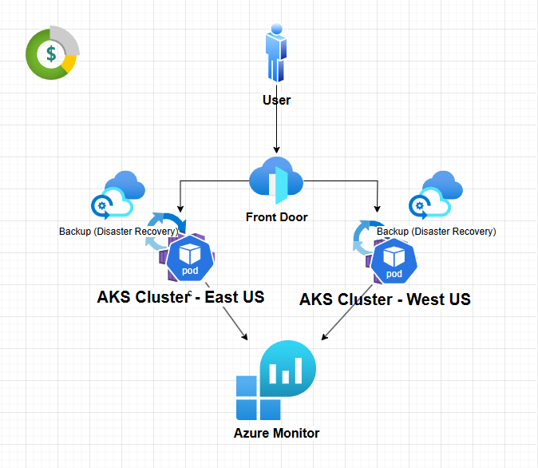
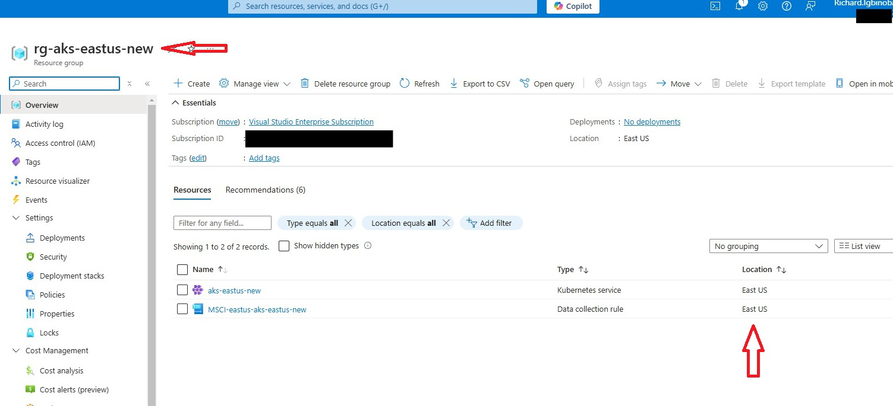
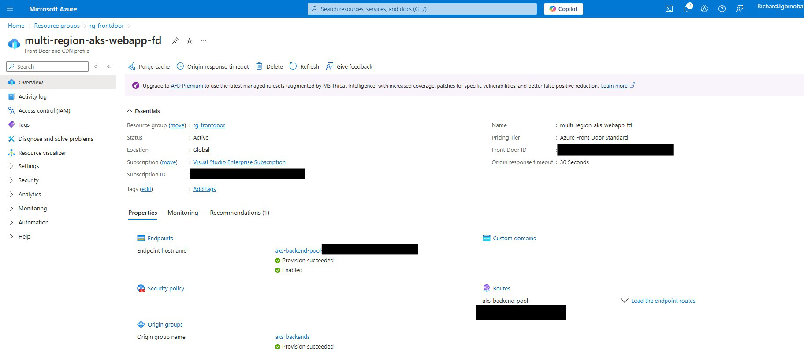
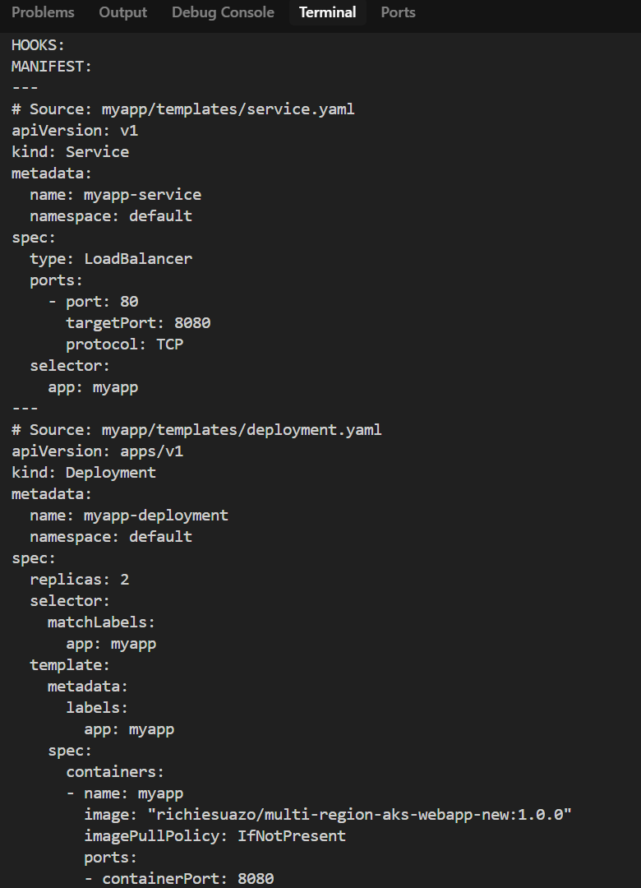
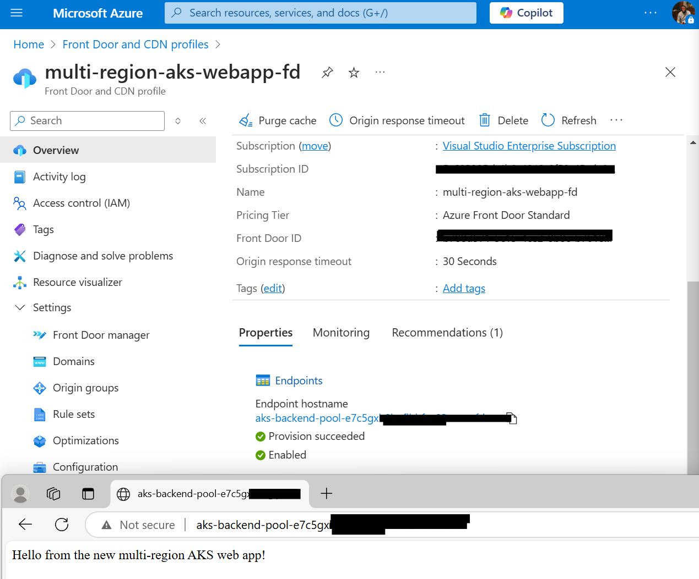
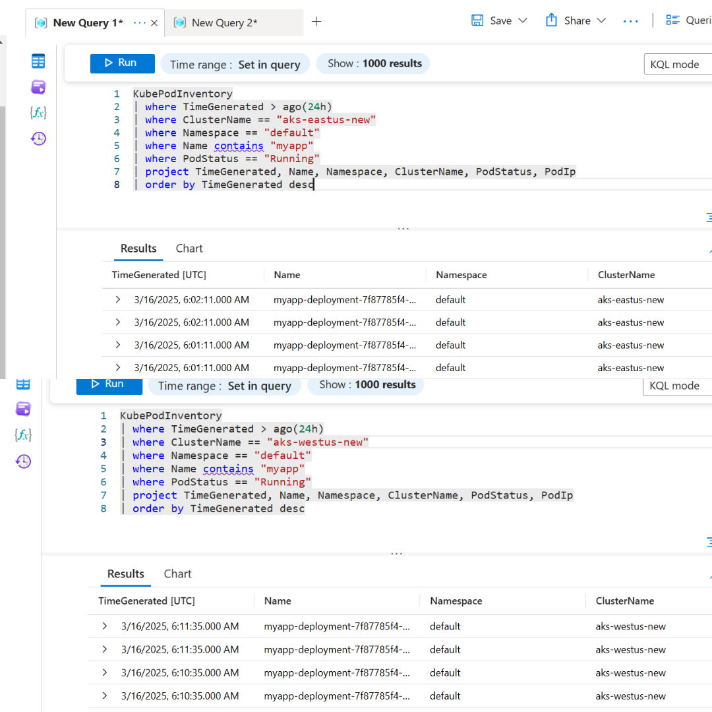
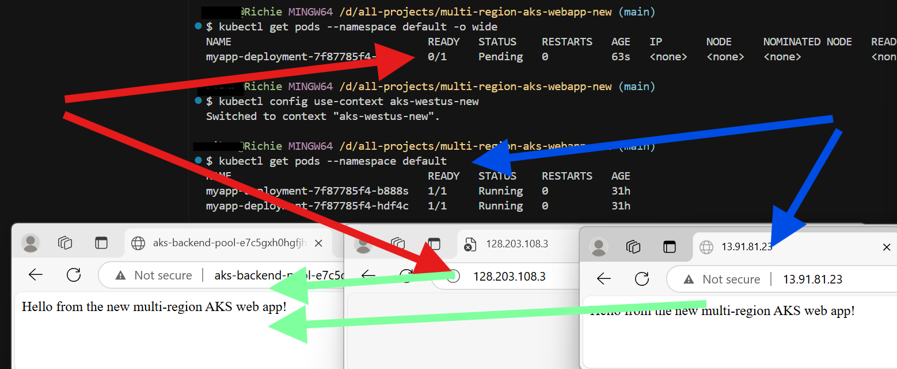

# Multi-Region AKS Web App with High Availability and Disaster Recovery

This project deploys a highly available Node.js web application across two Azure Kubernetes Service (AKS) clusters in East US and West US, leveraging Azure Front Door for global load balancing and failover. It includes observability with Azure Monitor and Log Analytics, a basic disaster recovery plan, and cost optimization tracked via Azure Cost Management—demonstrating senior-level DevOps skills in multi-region architecture and production-ready systems.

## Project Objective
Build a web app on AKS that spans multiple regions, ensuring 99.99% uptime, automated failover, real-time monitoring, and disaster recovery, while keeping costs optimized.

- Users access the app via Azure Front Door, which routes traffic to the nearest healthy AKS cluster.
- Two AKS clusters (East US and West US) host the Node.js app, deployed via Helm.
- Azure Monitor collects logs and metrics for observability.
- Manual snapshots enable disaster recovery.

## Tech Stack
- Azure Kubernetes Service (AKS)
- Helm
- Azure Front Door
- Azure Monitor
- Log Analytics
- Azure Cost Management

## Project Flow

### 1: AKS Clusters in Multiple Regions
- Two AKS clusters running in East US and West US, ensuring regional redundancy
- 
- 

### 2: Azure Front Door Configuration
- Azure Front Door set up to route traffic to both AKS clusters for load balancing and failover
- 

### 3: Helm Deployment of the Web App
- Deploying the Node.js app to AKS using Helm for consistent and scalable deployments.
- 

### 4: Application Accessible via Front Door
- The Node.js web app accessible through the Azure Front Door endpoint
- 
- 

### 5: Real-Time Monitoring with Azure Monitor
- Azure Monitor showing pod health in both regions and logs via a Log Analytics query
- 

### 6: Failover Test
- Simulated failure in the East US cluster; the app remains accessible via the West US cluster
- 

### 7: Cost Optimization with Azure Cost Management
- Tracking and optimizing cloud spend using Azure Cost Management

## Conclusion
This project showcases a robust GitOps workflow adaptable to production environments.
